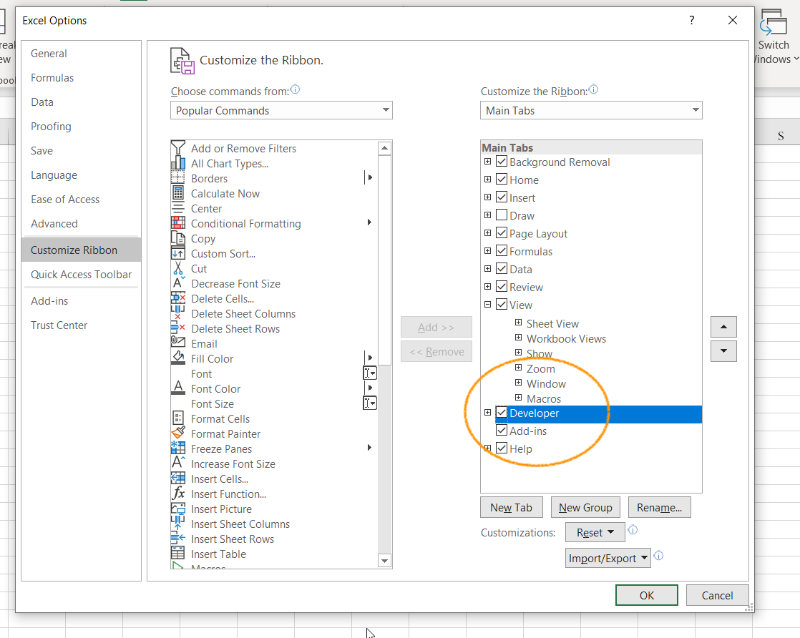
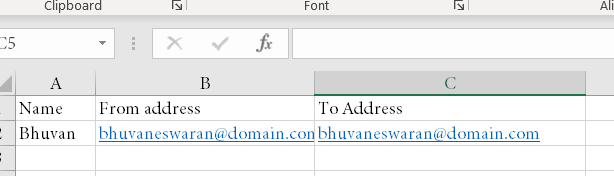
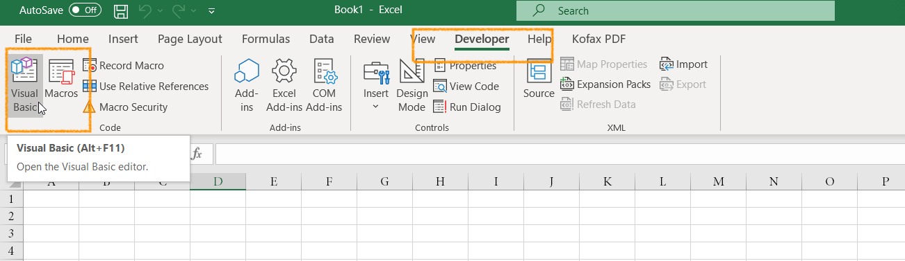
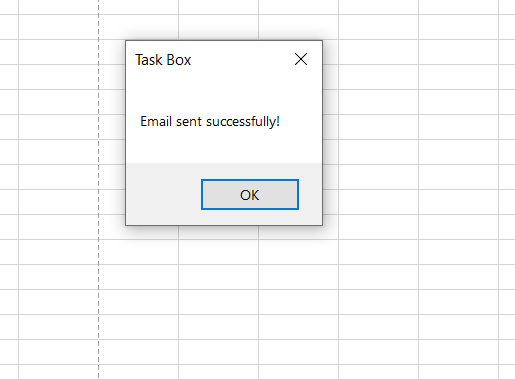

There are many ways we can send the bulk emails to the recipients. For this, we need to signup for email delivery services such as SendGrid, MailGun or we have to develop apps to send programmatically. However to get this approach, we need developer support to configure it and it takes more time.

In many cases, we have the email address in the excel sheet and need to send the message to these email address which is available in the sheet. To do this, we have to do it manually copy and pass the email addressess in the outlook which is a cumbersome process. 

We can automate the approach by using VBA(Virtual Basic for Application).

## Steps:

### Setup the environment

Open Microsoft Excel, check the Developer tab is enabled in the top header panel. If it's not, follow the below step else you can skip it.

File -> Options -> Customize the ribbon and select **Developer** checkbox in the right of the panel.



Once done, the **Developer** tab is enabled in the excel. 

### Setup the data

Open the data sheet and name it, lets say "SheetA"

Add three columns as like below,



You can add any number for rows based on the email recipient you have.

### Develop the script

Click on **Developer** tab and open the VB editor. Select the sheet to run the script.



It will open the VBA script, paste the below code. You can change the no. of recipients, email message, subject in the script.

```VB
Option Explicit
Public Pws As Worksheet, Sws As Worksheet, ParticipantName As String

Sub sendCertEMail()
    Dim count As Integer, NoOfParticipants As Integer, FilePath As String, ToEmail As String, ASMEmail As String
    
    Set Pws = Worksheets("SheetA")
    NoOfParticipants = 2 'Set the no. of records to send the email
    
    For count = 2 To NoOfParticipants
        ParticipantName = Pws.Range("A" & count).Value
        ToEmail = Pws.Range("B" & count).Value
        ASMEmail = Pws.Range("C" & count).Value
    
        'Send email
        Call Send_Mail(ASMEmail, ParticipantName, ToEmail)
    Next count

    MsgBox Title:="Task Box", Prompt:="Email sent successfully!"
           
End Sub

Private Sub Send_Mail(ASMEmail As String, ParticipantName As String, ToEmail As String)
    Dim OutApp As Object
    Dim OutMail As Object
    Dim strbody As String
    
    Set OutApp = CreateObject("Outlook.application")
    Set OutMail = OutApp.CreateItem(0)
    
    On Error Resume Next
    With OutMail
        strbody = "<html><p>Dear " & ParticipantName & ",</p>" & _
                "<p>This is test email.</p>" & _
                "<p>- Team</p>"

        .To = ToEmail
        .CC = ASMEmail
        .Subject = "Hooray! Test email"
        .HTMLBody = strbody
        
        OutMail.send
    End With
    On Error GoTo 0
    
    Set OutApp = Nothing
    Set OutMail = Nothing
End Sub
```

### Run the script

Run the program and you will get the alert message.



Bingo!!!

Now, you are able to send the email through VB script.